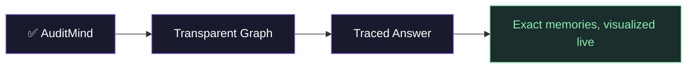
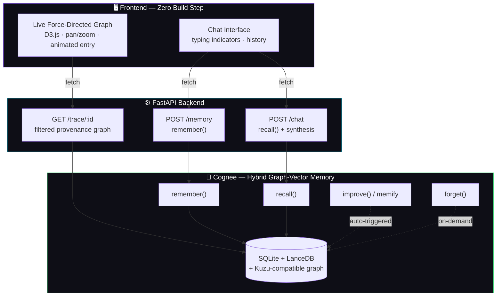

<div align="center">


<br/>

[](https://github.com/topoteretes/cognee)
[](https://fastapi.tiangolo.com/)
[](https://d3js.org/)
[](https://www.wemakedevs.org/hackathons/cognee)

<br/>

### *Not "what happened last night." **Why the AI thinks what it thinks.***

<br/>


</div>

<br/>

---

<br/>

## ⚡ The Black Box Problem

Every AI memory layer on the market today does the same four things: **ingest → embed → retrieve → answer.**

The retrieval step is invisible. You ask a question, you get a confident answer, and you have *zero* way of knowing which memories the system actually used, how they connect, or why one fact was weighted over another.

For a personal assistant making decisions on your behalf — that's not a UX nitpick. **That's a trust problem.**

<div align="center">




</div>

<br/>

## 🧠 What It Actually Does

<table>
<tr>
<td width="33%" valign="top">

### 1️⃣ Remember
Tell it anything in plain language. Cognee extracts entities, relationships, and structure automatically — building a real knowledge graph, not a flat vector dump.

</td>
<td width="33%" valign="top">

### 2️⃣ Recall
Ask a question. It doesn't keyword-match. It **traverses the graph**, fusing multiple unrelated facts into one coherent, synthesized answer.

</td>
<td width="33%" valign="top">

### 3️⃣ Trace
Click any answer and watch the **exact memory subgraph** that produced it animate into view — live, interactive, force-directed.

</td>
</tr>
</table>

<br/>

> Every answer is auditable. Every memory is traceable to its source. **Nothing is a black box.**

<br/>

## 🎬 See It Think

<div align="center">

```
   USER: "Why might Yashas be a strong fellowship candidate?"

   ┌──────────────────────────────────────────────┐
   │  ● Yashas may be a strong candidate due to:   │
   │    1. Co-founded EdgeDaemon (AI safety)       │
   │    2. PES University CS background             │
   │    3. Building AuditMind for Cognee hackathon │
   │                                                │
   │  ◎ click to view trace ↓                       │
   └──────────────────────────────────────────────┘

              ⬇ 144 total memories → 30 actually used ⬇

         ●────────●  edgedaemon ──mentions── provenance
        pes uni   auditmind         │
         │            │          singapore ai safety
      mentions      mentions          │
         │            │           fellowship · date
    [source doc]  [source doc]
```

*144 stored memories. 30 nodes shown. Zero noise. That ratio — not the raw graph — is the product.*

</div>

<br/>

## 🏗️ Architecture



<br/>

## 🔬 The Hard Part (Why Most Teams Won't Build This)

Cognee's `get_memory_provenance_graph()` returns the **entire** memory graph — every fact you've ever stored, all at once. The naive approach stops there: dump the whole graph, call it a "visualization," ship it.

AuditMind does the harder thing.

<table>
<tr>
<th width="50%">❌ Naive Approach</th>
<th width="50%">✅ AuditMind's Approach</th>
</tr>
<tr>
<td>

Return the full provenance graph for every answer

</td>
<td>

Filter to **only the entities that genuinely informed this specific response**

</td>
</tr>
<tr>
<td>

Treat every entity mention as equally relevant

</td>
<td>

Discard high-fanout generic nodes (e.g. the user's own name, present in nearly every fact) that don't actually discriminate relevance

</td>
</tr>
<tr>
<td>

Show 124 nodes for a 3-fact answer

</td>
<td>

Show 12-30 nodes — exactly what mattered, nothing more

</td>
</tr>
<tr>
<td>

"Here's everything I know"

</td>
<td>

"Here's exactly why I said that"

</td>
</tr>
</table>

<br/>

## 🧩 Tech Stack

<div align="center">

| Layer | Technology | Why |
|---|---|---|
| 🧠 **Memory** | [Cognee](https://github.com/topoteretes/cognee) (self-hosted) | Hybrid graph-vector lifecycle: `remember` / `recall` / `improve` / `forget` |
| 🤖 **Reasoning** | LLM via Cognee's structured output pipeline | Graph-grounded synthesis, not raw generation |
| ⚙️ **Backend** | FastAPI + Python | Async-first, auto-documented, fast |
| 🎨 **Frontend** | Vanilla JS + D3.js | Zero build step, real force-directed physics |
| 💾 **Storage** | SQLite · LanceDB · Kuzu-compatible graph | Self-hosted, fully auditable, no third-party data exposure |

</div>

<br/>

## 🚀 Quickstart

```bash
git clone https://github.com/yxshas565/auditmind-cognee.git
cd auditmind-cognee/backend
pip install -r requirements.txt
```

```bash
# set your LLM provider key (OpenAI or Anthropic — see app/main.py)
$env:OPENAI_API_KEY="your-key-here"

uvicorn app.main:app --reload
```

Open `frontend/index.html` directly in your browser — no build step, no bundler, no waiting.

```
🧠 Add a memory  →  💬 Ask a question  →  ◎ Click to watch it think
```

<br/>

## 🗺️ Roadmap

<details>
<summary><b>Click to expand the full build plan</b></summary>

<br/>

**Shipping now:**
- [x] `remember()` → `recall()` round trip
- [x] Entity-based provenance filtering (full graph → answer-relevant subgraph)
- [x] Live D3 force-directed trace visualization
- [x] Multi-turn chat UI with per-message trace history

**In progress:**
- [ ] `forget()` — selectively prune a memory, watch it vanish from future traces
- [ ] `improve()` / `memify` — visible reinforcement of frequently-confirmed facts
- [ ] Session-aware memory — conversational continuity, session vs. permanent memory distinction in the trace
- [ ] Bulk ingestion — paste a document instead of typing facts one at a time

See [`docs/roadmap.md`](docs/roadmap.md) for the complete, judged-criteria-mapped checklist.

</details>

<br/>

## 💭 Why This Matters Beyond the Hackathon

Personalization without explainability is a trust problem waiting to happen — for support agents making promises on your behalf, autonomous systems executing tasks, or anything operating with delegated memory over time.

**AuditMind is proof that "the AI remembers you" and "you can see exactly why" don't have to be in tension.**

They can be the same feature.

<br/>

---

<div align="center">

Built solo, under deadline pressure, for the **WeMakeDevs × Cognee Hackathon**

[](https://github.com/yxshas565)
[](https://yxshas565.github.io/yashas-portfolio/)

<br/>

**⭐ If this changed how you think about AI memory, star the repo.**

</div>